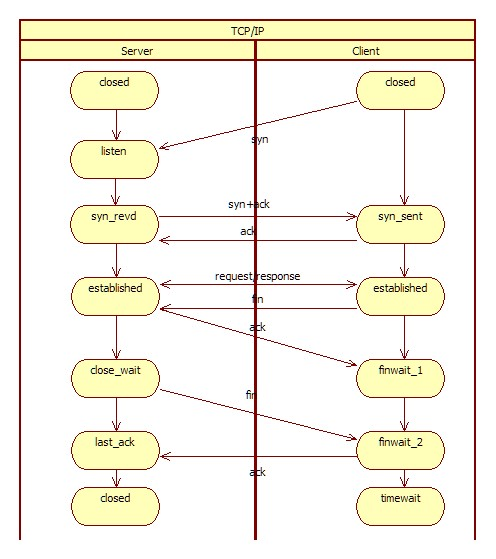
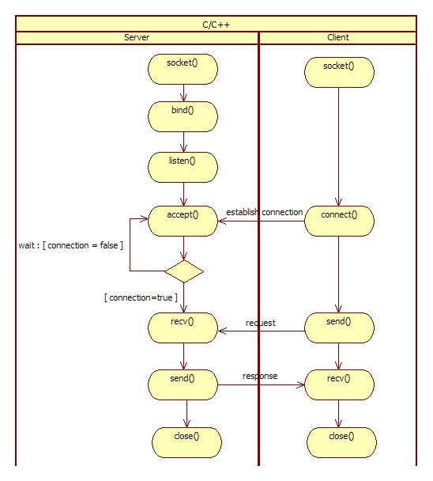
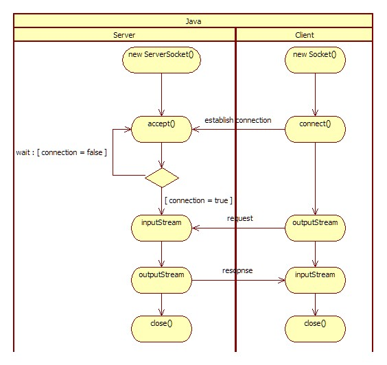

# #7, Java Network Programming - 개요 및 Socket
## 개요
Socket를 이용한 통신으로 IO, NIO를 사용하여 네트워크 통신  
주요 키워드 : Socket, IO, NIO, Selector

## Flow
### Tcp 통신

### C/C++ Network

### Java Network


## Code
### Client
```java
Socket socket = new Socket();
socket.connect(new InetSocketAddress(host, port));

/* send "REQ" */
byte[] writeBuf = {'R', 'E', 'Q'};
socket.getOutputStream().write(writeBuf, 0, writeBuf.length);

/* recv byte */
byte[] readBuf = new byte[16];
socket.getInputStream().read(readBuf, 0, readBuf.length);

socket.close();
```

### Server
```java
ServerSocket serverSocket = new ServerSocket(6000);
Socket socket = serverSocket.accept();

/* recv byte */
byte[] readBuf = new byte[16];
socket.getInputStream().read(readBuf, 0, readBuf.length);

/* send "RES" */
byte[] writeBuf = {'R', 'E', 'S'};
socket.getOutputStream().write(writeBuf, 0, writeBuf.length);

serverSocket.close();
```

## TO BE
- Client - connection timeout, Server - receive timeout  
대응 방법 및 Echo Server, Client 프로세스.
